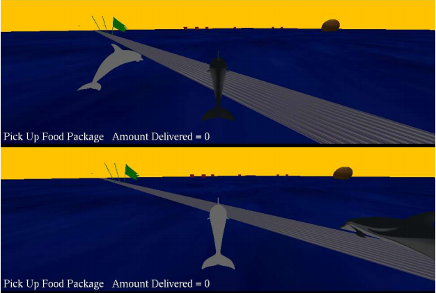

# Dolphin Food Delivery Contest

<h2> Game Description & Objective </h2>

<ul>
  <li>This is a contest between 2 players(dolphins). </li>
  <li> The game objective is picking up the food packages (red boxes) and delivering it 
to the planets. Once all 3 planets have been delivered to, race back and cross the 
finish line. </li>
  <li>To pick up the package, move your dolphin to the package and touch it. </li>
  <li>To drop off the package, move your dolphin to the planet and touch it.</li>
  <li>Look for the green flags, where the game starts, that is where the finish line is.</li>
  <li>If you forget what you need to be doing, look at the HUD, it will tell you to either 
pick up package, or deliver them. </li>
  <li> If all the packages have been delivered by both players and there is not a winner 
yet, all the planets will start bouncing, that means both players are racing back 
to the finish line, so hurry! </li>
 
</ul>
<h2>Keyboard/Gamepads Inputs:</h2> 
<ul>
  <li><b>W / Y-axis </b>: move forward </li>
  <li><b>A / X-axis</b> : move left  </li>
  <li><b>S / Y-axis</b> : move backward </li>
  <li><b>D / X-axis</b> : move right </li>
  <li><b> Arrows / RX, RY axis</b> : rotate camera or dolphin  </li>
  <li><b>Key 2/ button 3</b>: zoom in </li>
  <li><b>Key X/ button 0</b>: zoom out  </li>
  <li><b> ESC</b> : quit game </li>
</ul>
